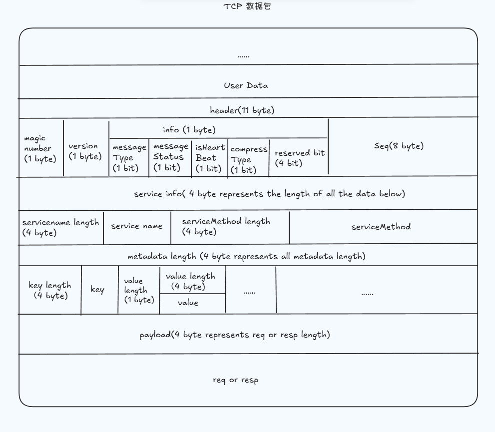

# ZRPC

zrpc is a rpc framework like [rpcx](https://github.com/smallnest/rpcx) and [gRPC](https://github.com/grpc/grpc-go).

zrpc encapsulates the zrpc protocol based on tcp, the protocol framework like this.
